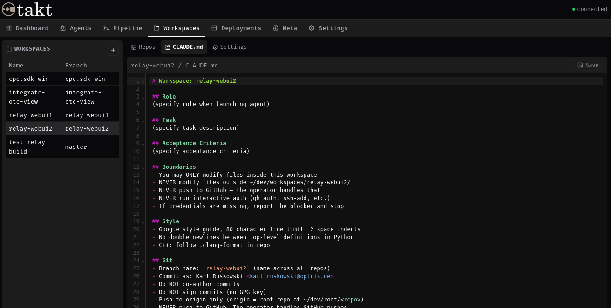

<p align="center">  </p>

Multi-agent pipeline orchestration for running Claude Code agents across multi-repo projects.

## What it does

- Creates isolated **workspaces** (local clones + branches) for parallel agent work across multiple repos
- Defines **pipelines** per workspace — ordered sequences of agent steps (with per-step model selection) and script steps (push, PR creation, upstream merge)
- Runs pipelines via a **background service** that watches for branch changes and executes steps in temporary worktrees
- Manages **deployment targets** (VMs and hardware) with exclusive locking and qcow2-backed VM cloning
- Runs **meta agents** for cross-cutting tasks (CLAUDE.md generation, pipeline setup, role template improvement)
- Provides a **web UI** (C++/Crow), **desktop GUI** (Tauri + React), **TUI** (Textual), **native CLI**, **MCP server**, and **REST/SSE API**



## Architecture

```
GitHub (upstream)
  |
  v
~/dev/root/<repo>           Local mirrors (fetch-only)
  |
  v
~/dev/workspaces/<name>/    Isolated clones, one per task
  |
  v
~/dev/runs/<ws>-<id>/<repo> Temporary worktrees per run
```

### Data flow

1. **Pull**: GitHub -> root repos (fetch via service or manual `git pull`)
2. **Clone**: root repos -> workspace clones (`workspace.py create`)
3. **Work**: agent modifies workspace clones, pushes to root repo (its origin)
4. **Watch**: takt-service detects branch changes in root repos, creates pipeline runs
5. **Execute**: pipeline steps run sequentially in temporary worktrees — agents via Claude Code SDK, scripts via Python functions
6. **Push**: operator reviews and pushes from root repos to GitHub (`push_to_github.py`)

### Design principles

- **Workspace name = branch name** across all repos. One identifier ties together repos, tools, and git history.
- **No direct GitHub push.** Agents push to origin (root repo) only. Human operator gates what reaches GitHub.
- **All state in SQLite.** Pipeline definitions, runs, steps, agent output, and branch refs live in `.state/takt.db` (WAL mode).
- **Per-step model selection.** Each agent step can run with a different Claude model (sonnet/opus/haiku).
- **Progressive context disclosure.** CLAUDE.md files are lean and point to context packets. Agents fetch what they need rather than loading everything upfront.
- **Pooled targets.** Deployment targets (VMs, hardware) are shared resources with exclusive locking. Agents claim, use, and release.

## Interfaces

### Web UI (einheit-ui)

Native C++ web server built on Crow and the einheit-ui framework. Serves at `http://takt/` (port 7542) with HTMX + WebSocket for live updates. Includes an in-browser shell (takt-cli), code editor, and dashboard panels for workspaces, pipelines, agents, and targets.

```bash
systemctl --user start einheit-ui
```

### Desktop GUI (Tauri + React)

Built with Tauri, React, and Chakra UI. Tabs for Dashboard, Agents, Pipeline, Workspaces, Deployments, Meta Agents, and Settings.

- **Workspaces**: repo status, inline CLAUDE.md editor, pipeline stage prompt editor, workspace settings
- **Pipeline**: runs with step output streaming via SSE, workspace filter, trigger button
- **Deployments**: target inventory, VM lifecycle, claim/release
- **Meta Agents**: run history, cost tracking, output streaming
- **Settings**: shared template editor (pipeline roles, workspace/repo CLAUDE.md templates)
- **Command bar**: shell-style command input with zsh-style tab completion cycling

```bash
cd gui && npm run tauri dev
```

### Native CLI (einheit-cli)

Interactive shell for workspace, target, pipeline, and agent management. Built on the einheit-cli framework with ZMQ transport to the takt service.

```bash
build/takt-cli
```

### TUI (Textual)

Terminal dashboard with live panels for workspaces, agents, pipeline runs, and targets. Connects to takt-service via ZMQ.

```bash
bin/takt.py
```

### MCP Server

FastMCP server wrapping the takt REST API. Installed at user scope so it's available in every Claude session on the machine — no per-project approval needed. Exposes workspace, target, pipeline, run, template, context, repo, agent, and account tools.

```bash
claude mcp add -s user takt .venv/bin/python3 bin/takt_mcp.py
```

### REST/SSE API

The background service exposes a REST API on port 7433 with SSE for real-time events.

```bash
curl http://localhost:7433/api/workspaces
curl http://localhost:7433/api/runs?workspace=my-ws
curl http://localhost:7433/api/events?topics=step.update
```

## Tools

| Tool | Purpose |
|------|---------|
| `bin/workspace.py` | Create/delete workspaces, define pipelines |
| `bin/takt_service.py` | Background service (REST API + pipeline execution) |
| `bin/takt.py` | Textual TUI (connects to takt-service) |
| `bin/takt_agent.py` | Conversational AI agent for the takt shell |
| `bin/takt_mcp.py` | MCP server for Claude sessions |
| `bin/pipeline_watch.py` | Standalone poll for branch changes |
| `bin/target.py` | Claim/release targets, VM lifecycle, SSH |
| `bin/clone_vm.py` | Create/delete qcow2-backed VM clones |
| `bin/provision_vm.py` | Provision Debian VM (build tools, shell config) |
| `bin/push_to_github.py` | Push branches from root repos to GitHub |
| `bin/setup_takt.py` | First-time setup (systemd, builds, /etc/hosts, MCP) |
| `bin/setup_win_vm.py` | Create Windows 11 VM (unattended) |
| `bin/provision_win_vm.py` | Provision Windows VM (VS2022, Git, Samba) |
| `bin/setup_libvirt.py` | Install libvirt/QEMU and configure networking |

## Quick start

```bash
# First-time setup (systemd units, C++ builds, MCP server)
python3 bin/setup_takt.py

# Create a workspace across multiple repos
bin/workspace.py create feature-auth RepoA RepoB

# Define a pipeline
bin/workspace.py pipeline-set feature-auth test push_to_github

# Start the background service
systemctl --user start takt-service

# Open the web UI
systemctl --user start einheit-ui
# -> http://takt/

# Or launch the desktop GUI
cd gui && npm run tauri dev

# Or the TUI
bin/takt.py

# Or trigger a run from the command line
bin/workspace.py trigger feature-auth

# Push to GitHub when ready
bin/push_to_github.py feature-auth
```

## Pipeline

Pipelines are ordered sequences of steps defined per workspace. Steps are either **agent** (Claude Code via SDK) or **script** (built-in Python functions).

Built-in scripts:
- `push_to_github` — push branch to GitHub in dependency order
- `create_pr` — create GitHub PRs via `gh` CLI
- `merge_upstream` — fetch and merge default branch into workspace branch

Agent steps run with a configurable model (sonnet/opus/haiku) and get a role prompt from `templates/pipeline_roles.md`. Per-step custom prompts can be edited inline in the Workspaces tab. Results are written to `.stage-result.json` in the worktree.

## Deployment targets

Targets are VMs and hardware registered in `config/targets.yaml`. Template VMs are read-only base images — agents work on clones.

Clones use qcow2 backing files (fast to create, space-efficient — only store diffs from the template). VMs use KVM with `-cpu host` for near-native performance and mount `~/dev` via Samba for zero-copy source access.

```bash
# Create a clone from a template
sudo python3 bin/clone_vm.py create deb-01 deb-02 \
  --ip 10.101.0.100

# Provision a Debian VM with build tools
python3 bin/provision_vm.py deb-02

# Manage targets
bin/target.py list
bin/target.py claim deb-02 feature-auth
bin/target.py run deb-02 "cmake --build ."
```

## Project layout

```
bin/                  CLI tools and scripts
lib/                  Shared Python library
  config.py           Constants, config loaders
  db.py               SQLite state layer
  pipeline.py         Pipeline executor
  service.py          Background service (ZMQ + asyncio)
  api.py              REST/SSE API (aiohttp)
  agent_runner.py     Claude Code SDK wrapper
  workspace_ops.py    Workspace operations
  git_utils.py        Git helpers
  meta_runner.py      Meta agent executor
adapters/             Native adapters (C++)
  ui/                 takt web UI adapter (einheit-ui)
  cli/                takt CLI adapter (einheit-cli)
binaries/             Native entry points (C++)
  takt-ui/            Web UI binary (Crow server)
  takt-cli/           Interactive CLI binary
gui/                  Tauri + React desktop GUI
  src/                React components (Chakra UI)
  src-tauri/          Tauri backend (Rust)
tui/                  Dashboard TUI (Textual)
  tabs/               Tab implementations
  widgets/            Reusable panel widgets
config/
  repos.yaml          Managed repo registry (gitignored)
  targets.yaml        Target inventory (gitignored)
  takt.yaml           Service config (API port, agent model)
templates/            CLAUDE.md templates, pipeline roles
context/              Architecture and decision docs
graphics/             Logos and icons
tests/                Unit tests
```

## Requirements

- Python 3.11+ with PyYAML, pyzmq, textual, aiohttp, claude-code-sdk
- C++23 compiler, CMake 3.25+ (for web UI and CLI)
- Node.js 18+, Rust (for desktop GUI)
- Git
- libvirt + QEMU (for VM management, optional)
- [Claude Code](https://docs.anthropic.com/en/docs/claude-code)

## License

MIT — see [LICENSE](LICENSE).
